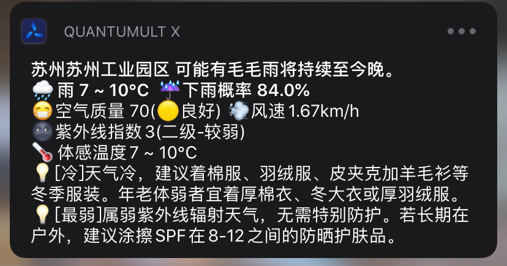
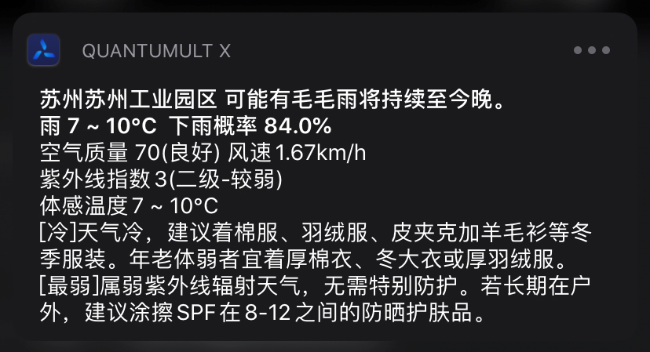
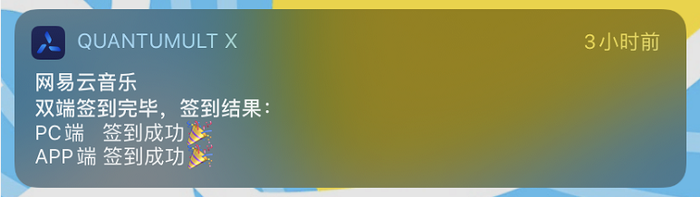
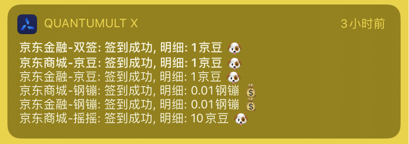

由于作者最近比较忙,没有时间维护脚本了,请大家自行决定还用不用吧,谢谢

# TaskConfig
> QuantumultX专用的任务执行，作者没有Surge因此无法进行适配，请谅解…

`推荐mitm用完后注释掉,不要常开吧`

## Surge/QuantumultX兼容脚本

> 此功能来源于此git
>
> 如有引用或基于此版本的修改请注明即可

只要在您的脚本最前面追加上这段js,就可以在surge和qx上直接运行,简单粗暴

[具体文件就在根目录下的smart.js](./smart.js)

使用也非常简单:

将[smart.js](./smart.js)中的内容拷贝到你想使用的脚本**最前面**,就可以了呢


### 示例

你原本的脚本，比如叫weather.js，打开后里面的内容是这样的

```javascript
//这里是原来的脚本
我是surge的脚本
我是surge的脚本
我是surge的脚本
```

把[smart.js](./smart.js)文件打开，将里面的文本内容拷贝到weather.js的最前面保存后即可使用

```
//这里是smart.js的内容
我是smart.js的内容
我是smart.js的内容
我是smart.js的内容

//这里是原来的脚本
我是surge的脚本
我是surge的脚本
我是surge的脚本
```

这个样子就可以了

### TIPS

目前是支持了cookie的读写+http请求+消息通知

应该已经足够了,如果您有其他功能需要兼容,也可以在issue中提出

## 功能

### 天气

> 此功能来源于此git
>
> 如有引用或基于此版本的修改请注明即可





#### API KEY申请

使用此脚本需要申请key

- [Dark Sky API](https://darksky.net/dev)
- [Aqicn API](http://aqicn.org/data-platform/token/#/)
- [和风天气API](https://dev.heweather.com/)

#### 配置项

js文件一打开最前面就是这个配置

申请一下两个api的key,再用谷歌地图获取一下你想获取位置的经纬度填入即可

```javascript
let config = {
    darksky_api: "填这里", //从https://darksky.net/dev/ 上申请key填入即可
    aqicn_api: "填这里", //从http://aqicn.org/data-platform/token/#/ 上申请key填入即可
    huweather_apiKey: "faead3de5f42420098c8132b3924cd09", //和风天气APIkey,可自行前往 https://dev.heweather.com/ 进行获取,推荐自行获取,此key每天只可使用1000次,超了就获取不到数据了
    lat_lon: "填这里", //请填写经纬度,直接从谷歌地图中获取即可
    lang: "zh", //语言,请不要修改
    show: {
        log: 0, //调试日志,0为不开启,1为开启,2为开启精简日志
        icon: true, //是否显示图标信息,不显示会比较精简
        aqi: true, //空气质量以及风速显示,false则不显示
        uv: true, //紫外线显示,false则不显示
        apparent: true, //体感温度显示,false则不显示
        lifestyle: { //此处用于显示各项生活指数，可自行调整顺序，顺序越在前面则显示也会靠前，如果您不想查看某一指数，置为false即可，想看置为true即可
            comf: false, //舒适度指数,
            cw: false, //洗车指数,
            drsg: true, //穿衣指数,
            flu: false, //感冒指数,
            sport: false, //运动指数,
            trav: false, //旅游指数,
            uv: false, //紫外线指数,
            air: false, //空气污染扩散条件指数,
            ac: false, //空调开启指数,
            ag: false, //过敏指数,
            gl: false, //太阳镜指数,
            mu: false, //化妆指数,
            airc: false, //晾晒指数,
            ptfc: false, //交通指数,
            fsh: false, //钓鱼指数,
            spi: false, //防晒指数
        }
    }
}
```

#### Task

```quanx_config
30 7 * * * task/weather_dark.js
```

### 天气PRO - 客制化

> 此功能来源于此git
>
> 如有引用或基于此版本的修改请注明即可

测试中，请勿使用

`此版本适用于能够耐心查看文件内容(最起码配置信息)的人`

`PRO版天气仅个人使用,不接受任何报错任何咨询`

#### 为何会有它的存在

由于每个人对天气的关注点不同，以及对于天气时效性的要求，现有的任何天气脚本都不能够满足

所以提供了一个可自主定制的天气脚本，您可以任意决定显示的位置+显示的数据

并且提供实时天气信息+全天天气信息的查询，具体可查询内容见配置项

#### API KEY申请

使用此脚本需要申请key

- [Dark Sky API](https://darksky.net/dev)
- [Aqicn API](http://aqicn.org/data-platform/token/#/)
- [和风天气API](https://dev.heweather.com/)

#### 配置项

```javascript
{
    darksky_api: "", //从https://darksky.net/dev/ 上申请key填入即可
    aqicn_api: "", //从http://aqicn.org/data-platform/token/#/ 上申请key填入即可
    huweather_apiKey: "", //和风天气APIkey,可自行前往 https://dev.heweather.com/ 进行获取
    lat_lon: "", //请填写经纬度,直接从谷歌地图中获取即可
    lang: "zh", //语言,请不要修改
    log: 2, //调试日志,0为不开启,1为开启,2为开启精简日志
    useParallel: 1, //接口读取方式:0并行1串行(1的速度比较快,0的速度稍慢一些,暂时直接用1就好了)
    show: {
        template: { //定制化信息
            title: `$[city] $[summary]`,
            subtitle: `$[weather] $[temperature] $[precipProbability]`,
            detail: `$[aqi]($[aqiDesc]) $[windSpeed] $[windDir]
$[uv]($[uvDesc]) $[currentHumidity]
$[apparentTemperature]
$[lifeStyle]`
        },
        lifestyle: { //此处用于显示各项生活指数，可自行调整顺序，顺序越在前面则显示也会靠前，如果您不想查看某一指数，置为false即可，想看置为true即可
            comf: false, //舒适度指数,
            cw: false, //洗车指数,
            drsg: true, //穿衣指数,
            flu: false, //感冒指数,
            sport: false, //运动指数,
            trav: false, //旅游指数,
            uv: true, //紫外线指数,
            air: false, //空气污染扩散条件指数,
            ac: false, //空调开启指数,
            ag: false, //过敏指数,
            gl: false, //太阳镜指数,
            mu: false, //化妆指数,
            airc: false, //晾晒指数,
            ptfc: false, //交通指数,
            fsh: false, //钓鱼指数,
            spi: false, //防晒指数
        }
    }
}
```

具体配置信息见[assets/weather_pro.md](./assets/weather_pro.md)

#### Task

```quanx_config
30 7 * * * task/weather_pro.js
```

## 签到

### 多合一签到脚本


轻松集成 轻松配置

具体详见 [all_in_one.md](./all_in_one.md)

### 百度贴吧

> 此功能来源于此git
> 
> 如有引用或基于此版本的修改请注明即可


#### 获取Cookie

```quanx_config
[rewrite_local]
# 如果您有百度贴吧APP，则可以使用此项配置，点击"我的"即可
#【需配置hostname = c.tieba.baidu.com】
;https?:\/\/c\.tieba\.baidu\.com\/c\/s\/login url script-request-header cookie/cookie_baidu_tieba_app.js

# 如果您不想使用APP,则可以直接网页浏览https://tieba.baidu.com ,弹出获取提示即可
#【需配置hostname = tieba.baidu.com】
;^https?:\/\/tieba.baidu\.com url script-request-header cookie/cookie_baidu_tieba_h5.js

[mitm]
#贴吧APP专用
hostname = c.tieba.baidu.com
#网页贴吧专用
hostname = tieba.baidu.com
```

#### Task

```quanx_config
[task_local]
# 表示每天07:32分执行一次
32 7 * * * task/sign_baidu_tieba_v2.js
```

#### 配置项

脚本有默认的配置，可以不用理会配置项，如果您想自定义，可以查看

```javascript
/*
脚本执行模式（默认值0）
 0 自动切换(30个以上贴吧,执行并行签到;30个一下执行串行签到)
 1 串行签到(签到速度快，但是贴吧过多的时候会导致qx崩溃)
 2 并行签到（签到速度稍慢，但可以全部执行签到且不会导致qx崩溃）
*/
var useParallel = 0;

/*
单次处理数量(默认值20)
由于系统通知可查看的消息行数有限,超过20行以后的数据不会在消息中显示
所以如果您想查看到每一个签到的具体情况,直接使用默认值20即可
如果你只想一次通知直接签到完毕,直接将此值修改为999即可
*/
var singleNotifyCount = 20; //想签到几个汇总到一个通知里,这里就填几个(比如我有13个要签到的,这里填了5,就会分三次消息通知过去)
```

#### 错误处理

目前常见的报错主要是`need vcode `

此错误表示需要输入验证码，非签到脚本的问题

这个需要您手动前去验证或者退出登录重新获取新的cookie试试

### 网易云音乐

> 此代码源于https://github.com/chavyleung/scripts
>
> 并进行提示和内部逻辑的优化
>
> 感谢[@chavyleung](https://github.com/chavyleung)



#### 获取Cookie

```quanx_config
[rewrite_local]
# 此处用于网易云音乐cookie获取，当失效时需浏览器访问并登录:https://music.163.com/m/login 获取cookie
^https?:\/\/music\.163\.com url script-request-header cookie/cookie_netease_music.js

[mitm]
hostname = music.163.com
```

#### Task

```quanx_config
[task_local]
# 表示每天07:33分执行一次
33 7 * * * task/sign_netease_music.js
```

### 爱奇艺会员

> 此代码源于 https://github.com/NobyDa/Script
>
> 仅拷贝过来
>
> 感谢[@NobyDa](https://github.com/NobyDa)


#### 获取Cookie

```quanx_config
[rewrite_local]
# 此处用于爱奇艺cookie获取，加mitm后打开APP，点击“我的”即可
https:\/\/passport\.iqiyi\.com\/apis\/user\/info\.action.*authcookie url script-request-header js/cookie/cookie_iqiyi.js

[mitm]
hostname = passport.iqiyi.com
```

#### Task

```quanx_config
[task_local]
# 表示每天07:34分执行一次
34 7 * * * js/task/sign_iqiyi_bonus.js
```

### 京东

> 此代码源于 https://github.com/NobyDa/Script
>
> 仅拷贝过来
>
> 感谢[@NobyDa](https://github.com/NobyDa)



#### 获取Cookie

```quanx_config
[rewrite_local]
# 此处用于京东cookie获取，当失效时需要手动登录京东网页版https://bean.m.jd.com/签到获取Cookie, 待QX弹出获取成功通知即可
;https:\/\/api\.m\.jd\.com\/client\.action.*functionId=signBeanIndex url script-request-header cookie/cookie_jd_bonus.js

[mitm]
hostname = api.m.jd.com
```

#### Task

```quanx_config
[task_local]
# 表示每天07:31分执行一次
31 7 * * * task/sign_jd_bonus.js
```

### V2EX

> 此代码源于https://github.com/chavyleung/scripts
>
> 并对cookie的获取进行优化,使得cookie可以得到及时的更新
>
> 感谢[@chavyleung](https://github.com/chavyleung)


#### 获取Cookie

```quanx_config
[rewrite_local]
# 此处用于V2EX cookie获取，浏览器打开https://www.v2ex.com/mission/daily 后提示成功即可
^https:\/\/www\.v2ex\.com\/mission\/daily url script-request-header cookie/cookie_v2ex.js

[mitm]
hostname = *.v2ex.com
```

#### Task

```quanx_config
[task_local]
# 表示每天07:31分执行一次
31 7 * * * task/sign_v2ex.js
```

### 电信营业厅

目前单独版本的电信营业厅已不再维护,请切换到多合一脚本

具体详见 [all_in_one.md](./all_in_one.md)
