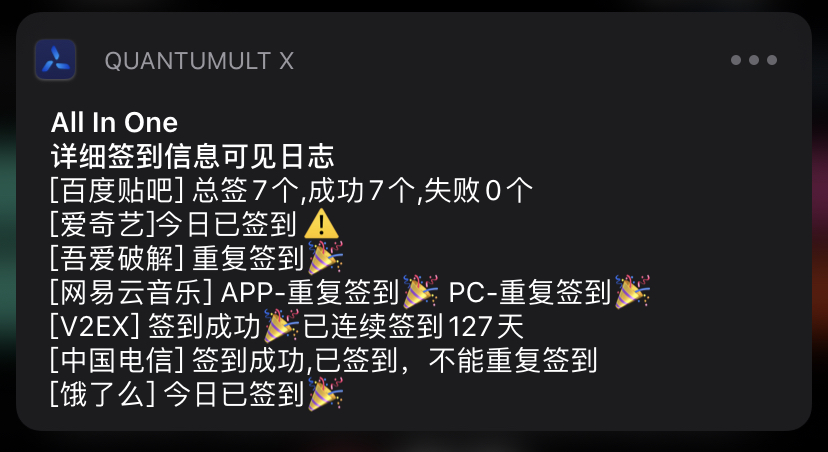

>由于作者最近比较忙,没有时间维护脚本了,请大家自行决定还用不用吧,谢谢

# 多合一签到脚本

> 此脚本支持QuantumultX和Surge,但是给出的示例都是qx的
>
> 因qx190以后支持区分script-request-header,所以技术上可以将cookie获取和签到放到一个js里面了
>
> 原有的all_in_cookie和all_in_sign合并了起来,并且删除掉他们,请各位老客重新配置一下



**支持列表**

|    名称    | Cookie |                             签到                             |                     感谢                     |     说明     |
| :--------: | :----: | :----------------------------------------------------------: | :------------------------------------------: | :----------: |
|  百度贴吧  |   ✅    |                              ✅                               |                    我自己                    |              |
| 电信营业厅 |   ✅    |                              ✅                               |                    我自己                    |              |
| 网易云音乐 |   ✅    |                              ✅                               | [@chavyleung](https://github.com/chavyleung) |              |
|    京东    |   ✅    | [获取](https://github.com/NobyDa/Script/blob/master/JD-DailyBonus/JD_DailyBonus.js) |     [@NobyDa](https://github.com/NobyDa)     | cookie同原版 |
|  吾爱破解  |   ✅    |                              ✅                               |     [@NobyDa](https://github.com/NobyDa)     | cookie同原版 |
| 爱奇艺VIP  |   ✅    |                              ✅                               |     [@NobyDa](https://github.com/NobyDa)     | cookie同原版 |
|   饿了么   |   ✅    |                              ✅                               |                    我自己                    |              |
|   人人视频  | ✅    |                              ✅                               | [@chavyleung](https://github.com/chavyleung) |  cookie同原版 |           

脚本地址:

**https://github.com/sazs34/TaskConfig/blob/master/all_in_one.js**

## 脚本配置说明

打开js文件,最开头的地方就能看到如下一段代码

```javascript
//因为有的人只有其中一个或两个需要进行签到,所以进行了配置化,可以指定签到
const global = {
    log: 1, //日志模式:0不显示 1全部显示 2精简显示,推荐值:1
    sign: { //用于设置哪些需要进行签到,哪些不处理
        baidu_tieba: true,
        iqiyi: true,
        _52pojie: true,
        netease_music: true,
        v2ex: true,
        weibo_super: true,
        china_telecom: true,
        rrtv: true,
        eleme: true
    },
    data: {
        //此处输入要签到的手机号码
        china_telecom: '18888888888'//替换手机号部分即可
    }
}
```

| 节点 |      作用      |                 说明                 |
| :--: | :------------: | :----------------------------------: |
| log  | 在qx中显示日志 | 0不显示 1全部显示 2精简显示,推荐值:1 |
| sign |  控制是否签到  |     true为进行签到,false为不签到     |
| data |    额外参数    |        用于签到脚本中数据配置        |

**额外参数说明**

|     节点      |                         说明                          |
| :-----------: | :---------------------------------------------------: |
| china_telecom | 如果要签到电信营业厅,需填写获取cookie时对应的手机号码 |
|               |                                                       |

## Quantumult配置说明

### MITM

此处需要获取Cookie时直接使用即可

使用完注释掉或者直接放着都行，没什么大影响，但是饿了么的最好注释掉,好像会影响部分饿了么接口的加载

```
[mitm]
# cookie获取专用,仅获取cookie时使用
hostname = tieba.baidu.com, c.tieba.baidu.com, music.163.com, passport.iqiyi.com, www.52pojie.cn, *.v2ex.com, weibo.com, wapside.189.cn, h5.ele.me, *.rr.tv
```
### REWRITE

此处直接放着就好,不需要注释掉

```
[rewrite_local]
# 此处用于京东cookie获取，当失效时需要手动登录京东网页版https://bean.m.jd.com/ 签到获取Cookie, 待QX弹出获取成功即可
https:\/\/api\.m\.jd\.com\/client\.action.*functionId=signBeanIndex url script-request-header all_in_one.js
# 此处用于百度贴吧cookie获取，当失效时需手动登录https://tieba.baidu.com/index.html贴吧获取cookie，待弹出获取成功即可
^https?:\/\/tieba.baidu\.com url script-request-header all_in_one.js
# 此处用于电信营业厅APP cookie获取,获取后记得去all_in_one.js中配置手机号码
https:\/\/wapside\.189\.cn:9001\/api\/home\/sign url script-request-header all_in_one.js
# APP端直接进去，点击"我的"即可
https?:\/\/c\.tieba\.baidu\.com\/c\/s\/login url script-request-header all_in_one.js
# 此处用于网易云音乐cookie获取，当失效时需浏览器访问并登录:https://music.163.com/m/login 获取cookie，待弹出获取成功即可
^https?:\/\/music\.163\.com url script-request-header all_in_one.js
# 此处用于爱奇艺cookie获取，加mitm后打开APP，点击“我的”，待弹出获取成功即可
https:\/\/passport\.iqiyi\.com\/apis\/user\/info\.action.*authcookie url script-request-header all_in_one.js
# 此处用于52破解cookie获取,浏览器访问https://www.52pojie.cn/home.php?mod=space 即可
https:\/\/www\.52pojie\.cn\/home\.php\?mod=space url script-request-header all_in_one.js
# 此处用于V2EX cookie获取，浏览器打开https://www.v2ex.com/mission/daily ，待弹出获取成功即可
^https:\/\/www\.v2ex\.com\/mission\/daily url script-request-header all_in_one.js
# 饿了么Cookie获取, 打开APP,点击我的,点击左上角的签到,进入页面即可
^https:\/\/h5\.ele\.me\/restapi\/eus\/v\d\/current_user url script-request-header all_in_one.js
# 人人视频Cookie获取, 打开APP,访问个人中心即可
^https:\/\/api\.rr\.tv\/user\/profile url script-request-header all_in_one.js

```

### task配置

```
[task]
0 0 * * * all_in_one.js
```

## 触发Cookie方式

|    名称    |  方式  |                     说明                      |
| :--------: | :----: | :-------------------------------------------: |
|  百度贴吧  | 浏览器 |      https://tieba.baidu.com/index.html       |
|  百度贴吧  |  APP   |            进入APP,点击"我的"即可             |
| 电信营业厅 |  APP   |         进入APP,点击"我",签到即可获取         |
|   网易云   | 浏览器 |         https://music.163.com/m/login         |
|   爱奇艺   |  APP   |            进入APP,点击"我的"即可             |
|  吾爱破解  | 浏览器 |   https://www.52pojie.cn/home.php?mod=space   |
|    V2EX    | 浏览器 |      https://www.v2ex.com/mission/daily       |
|   饿了么   |  APP   | 打开APP,点击"我的",点击左上角签到进入页面即可 |
|   人人视频   |  APP   | 打开APP,点击"我的",访问个人中心即可 |
