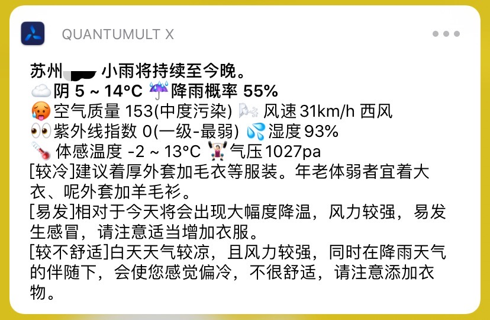
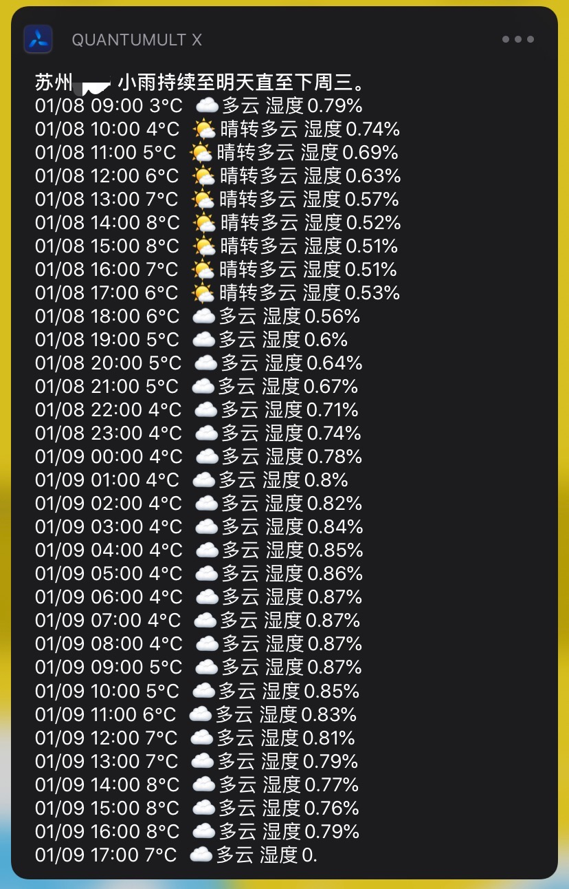
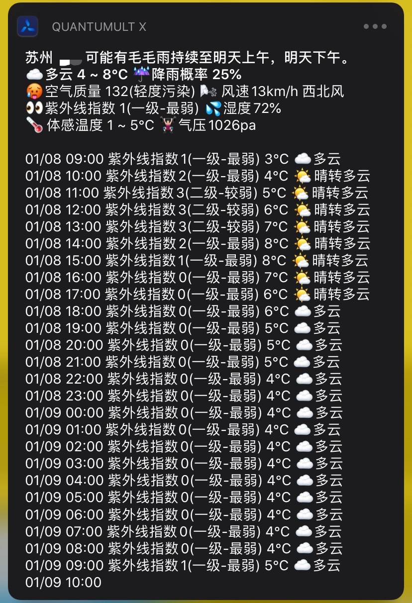

## 前言

文件地址：https://github.com/sazs34/TaskConfig/blob/master/task/weather_pro.js

**此脚本已兼容Surge和QuantumultX**

为了满足多元化的天气信息查询(其实就是开发者想写着玩而已)

提供了快捷地天气信息查询支持

能够快速地查看`当天天气` `7天天气` `48小时逐小时天气`

您可以自由地进行配置,混搭,想怎样就怎样

*然后这个仅限有耐心看完文档的人进行配置*

如果您没有耐心看完文档，文件本身也提供了默认的模板在，用于每日天气的显示

**不提供任何技术支持，仅个人使用分享出来而已**

**不提供任何技术支持，仅个人使用分享出来而已**

**不提供任何技术支持，仅个人使用分享出来而已**

## 说明

这个就相当于一个占位符

比如我要显示的内容是`北京 晴 --@wechatu`

则这里面包含了`城市名称` `天气描述` `diy任意文字`

根据文档最后面的模板配置信息来看，这里面全都是用的普通模板

则我的模板就要写成

```
$[city] $[weather] --@wechatu
```

### 配置项位置

位于配置中`congfig - show -template`

```javascript
let config = {
    darksky_api: "填这里", //从https://darksky.net/dev/ 上申请key填入即可
    aqicn_api: "填这里", //从http://aqicn.org/data-platform/token/#/ 上申请key填入即可
    huweather_apiKey: "填这里", //和风天气APIkey,可自行前往 https://dev.heweather.com/ 进行获取,记得key类型选择WebApi
    lat_lon: "经纬度填这里", //请填写经纬度,直接从谷歌地图中获取即可
    lang: "zh", //语言,随意切换为您想要的语言哦(zh/zh-tw/ja/en/fr/...)
    log: 2, //调试日志,0为不开启,1为开启,2为开启精简日志
    timeout: 0, //超时时间,单位毫秒(1000毫秒=1秒),一般不推荐修改[为0则不限制超时时间]
    show: {
        //(〃'▽'〃)就是这里就是这里，就在这里填模板的
        template: {
            title: `$[city]$[district] $[summary]`,
            subtitle: `$[weatherIcon]$[weather] $[temperatureMin] ~ $[temperatureMax]°C ☔️降雨概率 $[precipProbability]%`,
            detail: `🥵空气质量 $[aqi]($[aqiDesc]) 🌬风速$[windSpeed]km/h $[windDir]
👀紫外线指数 $[uv]($[uvDesc]) 💦湿度$[currentHumidity]%
🌡体感温度 $[apparentTemperatureMin] ~ $[apparentTemperatureMax]°C 🏋🏻‍♀️气压$[atmosphere]pa
$[lifeStyle($[icon][$[brf]]$[txt])]`
        },
        lifestyle: { //此处用于显示各项生活指数，可自行调整顺序，顺序越在前面则显示也会靠前，如果您不想查看某一指数，置为false即可，想看置为true即可
            drsg: true, //穿衣指数,
            flu: true, //感冒指数,
            comf: true, //舒适度指数,
            cw: false, //洗车指数,
            sport: false, //运动指数,
            trav: false, //旅游指数,
            uv: false, //紫外线指数,
            air: false, //空气污染扩散条件指数,
            ac: false, //空调开启指数,
            ag: false, //过敏指数,
            gl: false, //太阳镜指数,
            mu: false, //化妆指数,
            airc: false, //晾晒指数,
            ptfc: false, //交通指数,
            fsh: false, //钓鱼指数,
            spi: false, //防晒指数
        }
    }
}
```


## 示例

### 每日天气查看



#### 对应模板

```javascript
template: {
            title: `$[city]$[district] $[summary]`,
            subtitle: `$[weatherIcon]$[weather] $[temperatureMin] ~ $[temperatureMax]°C ☔️降雨概率 $[precipProbability]%`,
            detail: `🥵空气质量 $[aqi]($[aqiDesc]) 🌬风速$[windSpeed]km/h $[windDir]
👀紫外线指数 $[uv]($[uvDesc]) 💦湿度$[currentHumidity]%
🌡体感温度 $[apparentTemperatureMin] ~ $[apparentTemperatureMax]°C 🏋🏻‍♀️气压$[atmosphere]pa
$[lifeStyle([$[brf]]$[txt])]`
        }
```

### 一周天气查看


#### 对应模板

```javascript
template: {
            title: `$[city]$[district] $[weeklySummary]`,
            subtitle: ``,
            detail: `$[daily($[month]月$[day]日  $[temperatureLow]~$[temperatureHigh]°C  $[weatherIcon]$[weather])]`
        }
```


### 48小时天气查看



#### 对应模板

```javascript
template: {
            title: `$[city]$[district] $[weeklySummary]`,
            subtitle: ``,
            detail: `$[hourly($[month]/$[day] $[hour]:00 $[temperature]°C  $[weatherIcon]$[weather] 湿度$[humidity]%)]`
        }
```

### 混搭



#### 对应模板

```
template: {
            title: `$[city]$[district] $[summary]`,
            subtitle: `$[weatherIcon]$[weather] $[temperatureMin] ~ $[temperatureMax]°C ☔️降雨概率 $[precipProbability]%`,
            detail: `🥵空气质量 $[aqi]($[aqiDesc]) 🌬风速$[windSpeed]km/h $[windDir]
👀紫外线指数 $[uv]($[uvDesc]) 💦湿度$[currentHumidity]%
🌡体感温度 $[apparentTemperatureMin] ~ $[apparentTemperatureMax]°C 🏋🏻‍♀️气压$[atmosphere]pa
        
$[hourly($[month]/$[day] $[hour]:00 紫外线指数$[uvIndex]($[uvDesc]) $[temperature]°C $[weatherIcon]$[weather])]`
        }
```


## API KEY申请

使用此脚本需要申请key

- [Dark Sky API](https://darksky.net/dev)
- [Aqicn API](http://aqicn.org/data-platform/token/#/)
- [和风天气API](https://dev.heweather.com/) (注意生成key类型选择 WebApi)

## 可配置的选项

### 普通模板

可以直接调用，

|          配置项           |         功能         | 单位 |      示例值      |
| :-----------------------: | :------------------: | :--: | :--------------: |
|        $[province]        |          省          |      |       江苏       |
|          $[city]          |          市          |      |       苏州       |
|        $[district]        |          区          |      |     工业园区     |
|        $[summary]         |   全天气候变化概述   |      | 晴朗将持续一整天 |
|     $[weeklySummary]      |   一周气候变化概述   |      |  降雨持续一整周  |
|      $[weatherIcon]       |       天气图标       |      |        ☀️         |
|        $[weather]         | 天气描述(晴/雨/雪等) |      |     晴转多云     |
|   $[currentTemperature]   |       当前温度       |  ℃   |        22        |
|     $[temperatureMin]     |       温度低值       |  ℃   |        13        |
|     $[temperatureMax]     |       温度高值       |  ℃   |        26        |
| $[apparentTemperatureMin] |     体感温度低值     |  ℃   |        15        |
| $[apparentTemperatureMax] |     体感温度高值     |  ℃   |        23        |
|   $[precipProbability]    |       降雨概率       |  %   |        90        |
|          $[aqi]           |       空气质量       |      |        45        |
|        $[aqiIcon]         |     空气质量图标     |      |        🟢         |
|        $[aqiDesc]         |     空气质量描述     |      |        优        |
|       $[windSpeed]        |       全天风速       | km/h |        15        |
|    $[currentWindSpeed]    |       当前风速       | km/h |        13        |
|        $[windDir]         |       全天风向       |      |      西北风      |
|     $[currentWindDir]     |       当前风向       |      |      东南风      |
|       $[windPower]        |     全天风力等级     |      |       3-4        |
|    $[currentWindPower]    |     当前风力等级     |      |       3-4        |
|        $[humidity]        |     全天相对湿度     |  %   |        30        |
|    $[currentHumidity]     |     当前相对湿度     |  %   |        30        |
|       $[atmosphere]       |      全天大气压      |  Pa  |       1030       |
|   $[currentAtmosphere]    |      当前大气压      |  Pa  |       1030       |
|       $[visibility]       |      全天能见度      |  km  |        10        |
|   $[currentVisibility]    |      当前能见度      |  km  |        10        |
|           $[uv]           |      紫外线指数      |      |        3         |
|         $[uvDesc]         |      紫外线描述      |      |    二级-较强     |
|        $[sunrise]         |       日出时间       |      |      07:36       |
|         $[sunset]         |       日落时间       |      |      16:58       |
|        $[moonrise]        |       月出时间       |      |      04:47       |
|        $[moonset]         |       月落时间       |      |      14:59       |
|       $[lifeStyle]        |       生活指数       |      |       ...        |
|                           |                      |      |                  |
|           more            |   更多内容等待更新   |      |                  |

### 列表模板

> 用于多天/逐小时天气的渲染
>
> 可以同上面的普通模板同时使用

#### 逐小时天气(48小时)

##### 使用规则

$[hourly(`此处填入配置`)]

*需要注意哦*

*外面的那个$[hourly()]是必须要的，然后在括号里面填入配置项，用于列表渲染*

```
例如我每小时想要显示的内容是
12点 ☀️晴 温度12℃
13点 ☀️晴 温度13℃
则模板填入的内容是
$[hourly($[hour]点 $[weatherIcon]$[weather] 温度$[temperature]℃)]
外面$[hourly()]是固定的部分,仅在括号内填入配置
```

##### 配置项

|         配置项         |          功能           | 单位 |   示例    |
| :--------------------: | :---------------------: | :--: | :-------: |
|  $[month]  |   月份   |  月  |       10       |
|   $[day]   |   日期   |  日  |       05       |
|        $[hour]         |          小时           |      |    12     |
|       $[summary]       |          概述           |      | 多云转阴  |
|     $[weatherIcon]     |        天气图标         |      |     ☀️     |
|       $[weather]       |  天气描述(晴/雨/雪等)   |      | 晴转多云  |
|     $[temperature]     |          温度           |  ℃   |    12     |
| $[apparentTemperature] |        体感温度         |  ℃   |    10     |
|      $[humidity]       |          湿度           |  $   |    30     |
|      $[windSpeed]      |          风速           | km/h |     5     |
|     $[visibility]      |         能见度          |  km  |    16     |
|       $[uvIndex]       |       紫外线指数        |      |     5     |
|       $[uvDesc]        |       紫外线描述        |      | 一级-最弱 |
|     $[cloudCover]      | 被云遮挡的天空比例(0~1) |  %   |    91     |

#### 多天天气(7天)

$[daily(`此处填入配置`)]

|   配置项   |   功能   | 单位 |      示例      |
| :--------: | :------: | :--: | :------------: |
|  $[month]  |   月份   |  月  |       10       |
|   $[day]   |   日期   |  日  |       05       |
| $[summary] | 天气概述 |      | 小雨持续至下午 |
|     $[weatherIcon]     |        天气图标         |      |     ☀️     |
|       $[weather]       |  天气描述(晴/雨/雪等)   |      | 晴转多云  |
| $[temperatureHigh] | 温度高值 | ℃ | 20 |
| $[temperatureLow] | 温度低值 | ℃ | 13 |
| $[apparentTemperatureMax] | 体感温度高值 | ℃ | 18 |
| $[apparentTemperatureMin] | 体感温度低值 | ℃ | 14 |
|      $[humidity]       |          湿度           |  $   |    30     |
|      $[windSpeed]      |          风速           | km/h |     5     |
|     $[visibility]      |         能见度          |  km  |    16     |
|       $[uvIndex]       |       紫外线指数        |      |     5     |
|       $[uvDesc]        |       紫外线描述        |      | 一级-最弱 |
|     $[cloudCover]      | 被云遮挡的天空比例(0~1) |  %   |    91     |
|            |          |      |                |

#### 生活指数

$[lifeStyle(`此处填入配置`)]

| 配置项  |   功能   | 单位 |        示例         |
| :-----: | :------: | :--: | :-----------------: |
| $[icon] |   图标   |      |          🤧          |
| $[type] | 指数名称 |      |      感冒指数       |
| $[brf]  |   概述   |      |       较易发        |
| $[txt]  | 具体描述 |      | 寒冷潮湿,易发生感冒 |